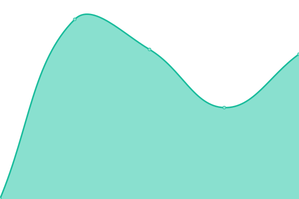

# [📈 Live Status](https://status.langbase.com/): <!--live status--> **🟩 All systems operational**

This repository contains the open-source uptime monitor and status page for [Langbase](https://langbase.com).

We use [Issues](https://github.com/LangbaseInc/langbase-status/issues) as incident reports, [Actions](https://github.com/LangbaseInc/langbase-status/actions) as uptime monitors, and [Pages](https://status.langbase.com/) for the status page.

<!--start: status pages-->
<!-- This summary is generated by Upptime (https://github.com/upptime/upptime) -->
<!-- Do not edit this manually, your changes will be overwritten -->
<!-- prettier-ignore -->
| URL | Status | History | Response Time | Uptime |
| --- | ------ | ------- | ------------- | ------ |
|  [Langbase API](https://api.langbase.com/health) | 🟩 Up | [langbase-api.yml](https://github.com/LangbaseInc/status/commits/HEAD/history/langbase-api.yml) | 

 986ms
     
 | 

<a href="https://status.langbase.com/history/langbase-api">100.00%</a>
    

<!--end: status pages-->

[**Visit our status website →**](https://status.langbase.com/)
